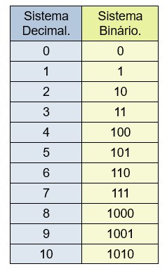
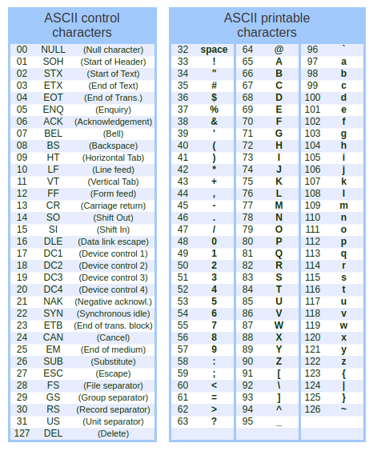
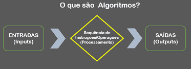
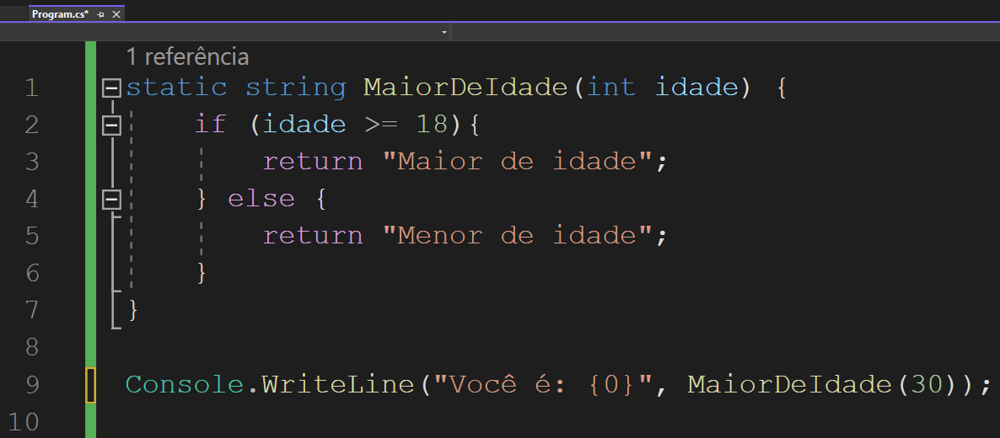

## Introdução a Programação + .Net Framework

O que é programar?

- Programar é sobre resolver problemas
- Programar é sobre ensinar a resolver problemas
- Programar é sobre ensinar computadores a resolver problemas

Como os computadores pensam?

- Computadores pensam?
    - Não 😅 (alguns diriam que ainda não)
    - Computadores manipulam números binários

- Sistema binários
    > O sistema binário é usado pelos computadores é e constituído de dois dígitos o 0 e o 1. A combinação desses dígitos leva o computador a criar várias informações: letras, palavras, textos, cálculos. 

    

- Sitema Hexadecaimal
    > Hexadecimal é o sistema numérico de base 16, denotado utilizando os símbolos 0–9 e A–F (ou a– f ). Por exemplo, o número decimal 79 (cuja representação binária é 01001111) pode ser escrito como 4F em hexadecimal (4 = 0100, F = 1111).

    

- Tabela ASCII
    > A Tabela ASCII (American Standard Code for Information Interchange) é usada pela maior parte da indústria de computadores para a troca de informações. A tabela ASCII original possui 120 caracteres, aqueles com código entre 0 e 127. (Veja na tabela abaixo a correspondência entre caractere e número).

    

- Programar é sobre resolver problemas
- Programar é sobre ensinar a resolver problemas
- Programar é sobre ensinar computadores a resolver problemas

O que é um algoritmo?

> Um passo a passo (ou sequência de instruções) para resolver um problema

- EX: Como salvar um contato na lista telefônica do celular?

    

    
Instruções

    - Passo 1: Peça o telefone da pessoa e anote em algum lugar.
    - Passo 2: Abra o aplicativo da lista telefônica do seu celular
    - Passo 4: Identifique a opção de `Novo Contanto` ou `Adicionar Contato` e toque-o
    - Passo 5: Adicione o nome da pessoa em seguinda o telefone
    - Passo 6: Salve-o e feche o aplicativo
    

- Algoritmos costumam ter entradas e saídas

    

Linguagem de Programação

- Línguas humanas são complexas e ambíguas, por isso são difíceis de compreender para computadores
- A linguagem de máquina do computador é difícil de compreender para humanos
- Linguagens de programação fazem a ponte!
- Existem linguagens de programação de diferentes níveis de abstração

- Assim como línguas humanas, linguagens de programação tem uma “gramática”, que chamamos de sintaxe
- Diferente de pessoas, computadores não sabem interpretar código “gramaticalmente incorreto”
    - Todo mundo perde 1 hora por causa de uma aspa ou uma vírgula de vez em quando, acontece!
- Exemplos de Linguagens de Programação
    

Exercício 1

[Meu primeiro algoritmo](https://padlet.com/dpereira26/7y58nn1m91bq70ku)

Exercício 2

[Light-Bot](https://armorgames.com/play/2205/light-bot)

